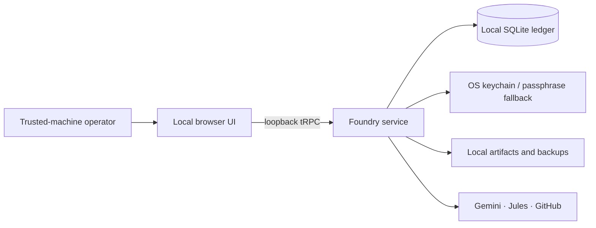

# Jules Foundry

**Jules Foundry** is a trusted-machine, local-first orchestration console for Google Jules coding sessions. It compiles bounded initiatives with Gemini, validates GitHub scope and branches, dispatches and supervises Jules sessions, preserves an auditable mission ledger, and applies its Quality Mesh before an operator accepts results.

The application runs on one operator’s machine. Its UI, SQLite audit database, local artifact store, backups, session-control ledger, evidence dossiers, and encrypted credential records remain local. The only intended outbound connections are to **Gemini**, **Google Jules**, and **GitHub**, and they originate only from the local server process.

## Local-first architecture



The server binds to **`127.0.0.1` only**. At launch it opens a one-time bootstrap URL and exchanges it for a short-lived, `HttpOnly`, `SameSite=Strict` local session cookie. The bootstrap capability is never persisted and is not written to application logs. A data-directory instance lock prevents concurrent Foundry processes from sharing one SQLite ledger. There is no cloud account, OAuth exchange, managed database, hosted object storage, analytics service, or cloud scheduler in the local runtime.

## Prerequisites

| Requirement | Purpose |
|---|---|
| Node.js 22 or later | Runs the local service and build tooling. |
| pnpm 10 or later | Installs locked dependencies. |
| A trusted user account on the machine | Holds the local data directory and OS secure-storage entry. |
| Gemini, Jules, and GitHub credentials | Entered later in the write-only Credential vault; they are not environment variables. |

## Install and start

By default, Foundry creates a random vault encryption key in the current operating-system credential store. On systems where secure storage is unavailable, use a strong vault passphrase in the **local launch environment**. The passphrase is a recovery-capable fallback, not an application setting or browser value. Use a password manager or operating-system secret launcher; do not commit it to the repository.

```bash
# Required only when OS secure storage is unavailable or intentionally disabled.
export FOUNDRY_VAULT_MODE=passphrase
export FOUNDRY_VAULT_PASSPHRASE="use-a-long-unique-local-passphrase"

pnpm install
pnpm dev
```

Foundry initializes its SQLite schema automatically, seeds the single `Local operator` identity, starts its monitor supervisor, and opens the one-time local browser session. If browser launching is unavailable on a headless machine, use the local launcher output rather than navigating to the port directly. Set `FOUNDRY_OPEN_BROWSER=false` only when a trusted wrapper handles the launch capability. If startup reports an existing Foundry instance, use that instance instead of deleting its lock file.

After the dashboard opens, configure and test Jules, Gemini, and GitHub credentials in **Credential vault**. Values are encrypted before persistence, never returned to the browser after submission, omitted from list procedures and mission events, and shown only as masked suffixes.

## Local data and backups

Foundry writes data outside the repository, using the operating system’s application-data convention:

| Platform | Default directory |
|---|---|
| Linux | `$XDG_DATA_HOME/jules-foundry` or `~/.local/share/jules-foundry` |
| macOS | `~/Library/Application Support/JulesFoundry` |
| Windows | `%APPDATA%\JulesFoundry` |

The directory contains `foundry.sqlite`, the SQLite write-ahead-log companion files while active, `artifacts/`, `backups/`, `logs/`, local preferences, and a non-secret vault salt when passphrase fallback is used. Use **Create local backup** in Credential vault or **Local operations** to produce a SQLite-consistent backup through `VACUUM INTO`; do not copy a live database file by itself while its WAL is active. The Local operations workspace exposes redacted health state, backup retention, recovery guidance, and the local lock/data locations.

Backup files contain encrypted credential ciphertext, never plaintext provider keys. Restoring a credential record requires the original OS credential-store key or the configured recovery passphrase. If neither is available, re-enter credentials in the local vault; Foundry intentionally has no secret-export mechanism. **Stage restore** integrity-checks a snapshot in a separate restore directory and refuses to overwrite the active ledger automatically.

## Monitoring and operation

The local monitor supervisor polls only due, non-terminal Jules sessions while Foundry is running. It uses persisted monitor checkpoints, activity identifiers, session-control leases, and idempotency keys, so restart recovery does not replay previously observed provider activity or create uncontrolled redispatch loops.

When Foundry closes or the computer sleeps, remote Jules work can continue but Foundry monitoring pauses locally. On the next launch, Foundry resumes from durable checkpoints. It never silently approves plans, deletes sessions, accepts evidence, merges code, or redispatches work; these remain explicit operator decisions.

## Development and verification

```bash
# Generate a new local SQLite migration after editing drizzle/schema.ts
pnpm db:generate

# Type-check the application
pnpm check

# Run all governance and local-first tests
FOUNDRY_VAULT_MODE=passphrase FOUNDRY_VAULT_PASSPHRASE="test-only-value" pnpm test

# Build the production local service and browser bundle
pnpm build

# Run the complete local-user release gate, including a lockfile-derived SBOM
pnpm release:verify

# Prepare the signed desktop bundle on a release machine with Rust/Cargo installed
pnpm desktop:prepare
```

The current suite covers task graph validation, credential write-only behavior, dispatch and poll idempotency, Quality Mesh verdicts, session controls, initiative deletion safeguards, Gemini model selection, local session rejection and bootstrap exchange, local SQLite initialization, backup inventory, staged recovery, storage-root containment, versioned vault encryption, single-instance locking, and restart-safe monitor checkpoint selection. The release gate also enforces a browser-chunk budget and writes a lockfile-derived SBOM.

## Security boundary

The local runtime is designed for a **single trusted machine**, not shared-host or multi-tenant operation. Keep the data directory owner-only, do not expose the loopback port with a tunnel or reverse proxy, and do not run the local data directory from a network filesystem. Gemini, Jules, and GitHub calls remain network operations and can be disabled by removing or deleting their local credential profiles.

For detailed operational procedures and migration notes, see [Local-first operations](docs/local_first_operations.md), [desktop release guidance](docs/desktop_release_guide.md), the [local runtime dependency audit](docs/local_runtime_dependency_audit.md), the [local-install readiness assessment](docs/local_install_readiness.md), and the [trusted-machine migration plan](docs/trusted_machine_local_first_migration_plan.md).
