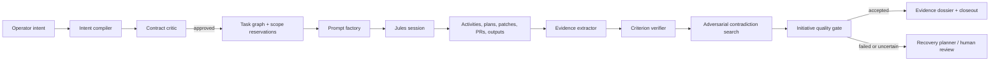

# Jules Foundry: LLM-Assisted Planning and Session Quality Automation

**Status:** Proposed product and implementation plan  
**Objective:** Automate high-quality task planning, prompt construction, completion analysis, and correctness verification for a complete Jules initiative without mistaking a provider-terminal state for proven success.

## Executive summary

Jules Foundry should evolve from a reliable session tracker into a **quality orchestration system**. It should convert an operator’s intent into a versioned engineering contract, compile that contract into evidence-carrying prompts, supervise Jules against the contract, and run a layered verdict process once every task is terminal. The core proposition is simple:

> **Jules completion is an observation. Foundry acceptance is an evidence-backed decision.**

The system should use Gemini as several tightly bounded evaluators rather than one opaque “judge.” A planning model produces structured task contracts; an independent critic challenges ambiguity and scope; a verification model maps artifacts to acceptance criteria; and an adversarial model actively searches for contradictions. Deterministic repository checks, GitHub status signals, and Jules activity artifacts remain the source of truth. LLM outputs are structured assessments linked to evidence, never unsupported claims.

| Lifecycle phase | Automated capability | Human role | Safe automated outcome |
|---|---|---|---|
| Intent intake | Produce a typed delivery contract and ambiguity map | Resolve material ambiguity or risk | Draft contract ready for review |
| Planning | Decompose work, allocate scope, predict integration points | Approve high-risk or low-confidence plans | Persisted dependency graph and task briefs |
| Prompting | Compile proof-carrying Jules prompts from the accepted contract | Adjust policy/templates when necessary | Idempotent, versioned dispatch prompt |
| In-session governance | Detect plan divergence, staleness, and unanswered questions | Approve plans or corrective guidance | Evidence-rich attention item or safe reminder |
| Task completion | Extract artifacts, map proof, run deterministic checks | Review material uncertainty | Task verdict with criterion-level provenance |
| Initiative closeout | Verify cross-task correctness and aggregate success | Resolve failed or conditional verdicts | Accepted, conditional, failed, or review-required initiative |

## 1. Design principles

The system should optimize for **calibrated automation**, not automatic approval. Every LLM call must have a narrow purpose, typed schema, model/version identifier, input digest, evidence references, and recorded confidence. A model cannot approve its own plan without an independent critic and deterministic preconditions. This separation reduces self-confirming reasoning.

| Principle | Requirement |
|---|---|
| Contract before code | Every dispatch originates from explicit outcomes, acceptance criteria, non-goals, allowed paths, and a verification recipe. |
| Two-pass reasoning | Use a planner to propose and a critic to challenge. Do not reuse the same prompt context as a sole reviewer. |
| Evidence before verdict | A criterion cannot become `proven` merely because Jules says it completed. It needs a linked artifact, check, diff fact, or repository observation. |
| Determinism has priority | Compilation, path-policy checks, dependency checks, test execution, and GitHub state checks outrank an LLM’s confidence. |
| Bounded recovery | Recovery actions are classified, budgeted, idempotent, and never create an uncontrolled loop of redispatches. |
| Learning is versioned | Prompt/template improvements are staged, evaluated on historical cases, and released through a controlled policy version. |

## 2. The Quality Mesh architecture

Introduce a **Quality Mesh** as an orchestration layer around the existing task graph, attempt ledger, mission timeline, approval gate, and evidence dossier. It is not a separate agent. It is a sequence of small, observable LLM and deterministic services.



Each box emits an append-only run record. Foundry therefore preserves not only what Jules did, but also **why it was asked to do it, what quality claim was evaluated, what proof was found, and why a final verdict was reached**.

## 3. Stage A — Intent compiler and engineering contract

### 3.1 Replace unstructured intake with a Contract Envelope

Use Gemini structured output to transform a user request into a `ContractEnvelope`. Gemini supports JSON-schema-constrained structured responses, making a typed contract materially safer than parsing prose. [1]

| Contract field | Purpose |
|---|---|
| `outcome` | User-visible result, stated as an observable condition. |
| `acceptanceCriteria[]` | Testable claims with a verification method and minimum proof strength. |
| `nonGoals[]` | Explicitly excluded behaviors and files. |
| `scopeHypotheses[]` | Proposed allowed paths, each marked grounded, inferred, or unresolved. |
| `riskProfile` | Security, migration, destructive-change, dependency, and integration risk. |
| `verificationRecipe` | Expected checks: tests, build, lint, type check, snapshot, manual inspection, or PR review. |
| `ambiguities[]` | Questions, potential interpretations, and impact if guessed incorrectly. |
| `integrationContracts[]` | APIs, schemas, public surfaces, or adjacent tasks that must remain compatible. |

The compiler should use repository metadata, recent open issues, target branch, and a narrow file-tree summary as grounding context. Untrusted repository text, issue comments, and README instructions must be treated as **data**, not as instructions to the compiler.

### 3.2 Introduce an ambiguity budget

The compiler should calculate an `ambiguityScore` and group unknowns by whether they affect correctness, security, API compatibility, or only style. Low-impact ambiguity can be resolved with a declared assumption. Material ambiguity should produce one of three outcomes: **clarify with operator**, **split discovery task**, or **dispatch only a bounded reconnaissance task**.

This prevents the common failure mode in which a broadly phrased prompt leads to a superficially plausible but unprovable change.

### 3.3 Independent contract critic

Run a second Gemini call with a different role and reduced prompt history. The **Contract Critic** must attempt to falsify the envelope by identifying missing criteria, conflicting non-goals, paths that are too broad, unverifiable claims, and dependency edges that cannot be satisfied.

The result is a typed `ContractReview`:

```ts
type ContractReview = {
  decision: "approve" | "revise" | "human_review";
  missingCriteria: string[];
  unsafeAssumptions: string[];
  scopeConcerns: { path: string; reason: string }[];
  requiredClarifications: string[];
  suggestedDeterministicChecks: string[];
  confidence: number;
};
```

Foundry should auto-advance only when the critic decision is `approve`, all path policies pass deterministically, and the risk policy permits autonomous planning. Otherwise, it should present a compact **Decision Brief** to the operator rather than raw model prose.

## 4. Stage B — Task graph and proof-carrying prompts

### 4.1 Use a task digital twin

For every graph node, create a **Task Digital Twin** before dispatch. This is a compact predicted record of what correct work should look like:

| Twin facet | Example |
|---|---|
| Intended change | Normalize README heading hierarchy and list formatting. |
| Allowed surface | `README.md` only. |
| Expected artifacts | Change set, rendered Markdown review, PR. |
| Expected checks | Markdown lint or parse, link check, diff scope check. |
| Invariants | Existing factual content remains intact; no code files change. |
| Failure signals | Changes outside allowed paths, removed material sections, broken links. |

The twin gives post-session verification a baseline against which it can compare the real diff, artifacts, and Jules narrative. It is a prediction, not a claim of repository truth.

### 4.2 Compile proof-carrying prompts

The Prompt Factory should assemble the approved contract into a compact Jules prompt with stable sections. The prompt must instruct Jules to work, but it must also request the evidence Foundry needs to verify success.

| Prompt section | Contents |
|---|---|
| Mission | Outcome and bounded task description. |
| Scope policy | Allowed paths, protected paths, and non-goals. |
| Acceptance contract | Numbered criteria in machine-stable identifiers such as `AC-1`. |
| Verification recipe | Commands, expected checks, and evidence to report. |
| Integration notes | Dependency constraints and public behavior that must remain intact. |
| Reporting protocol | Ask for concise mapping from change, test/output, and acceptance criterion. |
| Escalation rule | Ask Jules to request feedback rather than guessing when scope or requirement conflicts occur. |

The factory should create `promptVersion`, `templateVersion`, `contextDigest`, and `promptDigest`, then persist them before dispatch. A deterministic idempotency key must include the final prompt digest. This makes later quality analysis explainable and permits exact replay only under explicit operator authorization.

### 4.3 Plan divergence radar

When Jules emits a plan, run a comparison call between the Jules plan and the Foundry contract. The **Plan Divergence Radar** should label every criterion as covered, partially covered, extra/unapproved, or contradicted. It should also compare planned files with allowed paths and assess whether the plan’s test strategy is sufficient.

The plan approval UI should lead with a concise delta, not a wall of text. High-risk divergence blocks automatic approval. Low-risk stylistic deviations can be routed to a policy-defined approval mode. Jules exposes plan and approval activities through its session/activity model, so Foundry can retain the plan version and review record alongside other mission evidence. [2] [3]

## 5. Stage C — In-session quality supervision

Foundry should not continuously ask an LLM to narrate every activity event. Instead, use a **triggered supervision model**. This avoids noise, cost, and false intervention.

| Trigger | Automated assessment | Allowed outcome |
|---|---|---|
| New Jules plan | Contract-plan alignment and scope divergence | Approve, seek review, or draft guidance |
| Jules asks a question | Classify as blocked requirement, missing environment, or optional preference | Draft an operator response; never send without policy approval |
| Path change outside twin | Determine policy violation severity | Local hold and human review for material violations |
| Repeated failed command/output | Detect environment vs implementation failure | Recovery recommendation or attention state |
| Long silent interval | Compare state, last progress, poll history, and expected duration | Refresh/reconcile or mark stale |
| New pull request | Launch pre-verification ingestion | Evidence extraction queue |

The supervisor should emit **recommendations** with reasons, not silently mutate the remote session. Foundry can automate safe local actions, such as creating a review item or scheduling a reconciliation, but sending corrective guidance, approving a plan, or deleting a session must respect the existing command, attribution, idempotency, and confirmation controls.

## 6. Stage D — Completion, failure, and correctness verification

### 6.1 Separate terminal state from quality verdict

Once a Jules task is terminal, Foundry should launch a `VerificationRun`. Completion is only the start of the quality process. The run should gather the final session state, activities, plan, messages, patch/change set, bash output, PR metadata, CI state, and repository checks at the relevant commit.

| Verdict | Meaning | Follow-on action |
|---|---|---|
| `accepted` | All required criteria are proven; no material contradiction found. | Permit downstream dependencies and initiative closeout. |
| `conditionally_accepted` | Main outcome is proven, but minor non-blocking evidence debt remains. | Require policy-approved follow-up or human acknowledgement. |
| `failed_verification` | Evidence or deterministic checks contradict a required criterion. | Block dependent work and create recovery brief. |
| `needs_human_review` | Evidence is insufficient, ambiguous, or policy-sensitive. | Escalate with concise proof gap. |
| `provider_failed` | Jules reports failure; Foundry has classified the likely failure domain. | Create bounded recovery options. |

### 6.2 Build a three-lens verifier

The verifier must apply three complementary lenses, in this order.

| Lens | Inputs | Authority |
|---|---|---|
| Deterministic lens | Allowed-path diff, tests, build, lint, type check, GitHub checks, changed-file inventory | Highest; can fail acceptance directly. |
| Evidence lens | Activities, patches, output, PR description, implementation details | Maps evidence to each `AC-*` criterion with quoted excerpts or digests. |
| Adversarial lens | Contract, twin, deterministic results, and evidence map | Searches specifically for omissions, regressions, scope creep, false proof, and criterion contradictions. |

The deterministic lens first determines hard failures. The evidence model then emits a criterion ledger using the existing statuses: `proven`, `partial`, `unproven`, and `contradicted`. The adversarial model must argue against acceptance, not summarize the work. If its finding is material, it can downgrade the initiative verdict or require human review; it cannot manufacture proof.

### 6.3 Require criterion-scoped proof

Every evaluator must produce evidence references, not just explanations.

```ts
type CriterionVerdict = {
  criterionId: string;
  status: "proven" | "partial" | "unproven" | "contradicted";
  rationale: string;
  evidence: Array<{
    kind: "test" | "diff" | "activity" | "pr" | "repository_check";
    ref: string;
    excerpt?: string;
    observedAt: string;
  }>;
  counterEvidence: string[];
  confidence: number;
  requiresHumanReview: boolean;
};
```

The UI should show a **proof map** rather than a single LLM score. Operators can see the criterion, the model judgment, the exact supporting material, contradictions, and what further evidence would upgrade the verdict.

### 6.4 Failure intelligence and recovery planning

If Jules fails or verification fails, launch a separate `FailureAnalysisRun`. Its purpose is not to blame Jules; it is to determine the smallest safe next action.

| Failure domain | Typical signal | Recovery recommendation |
|---|---|---|
| Contract defect | Acceptance criterion ambiguous or contradictory | Amend contract and regenerate prompt; do not retry unchanged. |
| Prompt defect | Jules plan missed a critical constraint present in repository context | Revise prompt template/context and require plan review. |
| Scope defect | Needed file absent from allowed paths | Request operator scope decision. |
| Environment defect | Dependency, permission, CI, or provider issue | Create an environment remediation task; avoid code retry. |
| Implementation defect | Diff/test failure directly contradicts criterion | Create a narrow corrective task with failed evidence attached. |
| Provider uncertainty | Timeout, missing activities, inconsistent terminal state | Reconcile first; do not retry destructively. |

The recovery planner may generate a **Recovery Brief** and a proposed next task, but it must not automatically redispatch. Automatic retry is permitted only for explicitly classified transient provider failures, within a retry budget, where no remote side effect is uncertain.

## 7. Initiative-level closeout

The user’s goal is success of the entire task, not merely isolated sessions. Once every node in an initiative is terminal, Foundry should run an **Initiative Quality Gate**.

It should evaluate dependency consistency, cross-task path overlap, aggregate test/build state, unresolved evidence debt, PR relationships, and whether the original `outcome` is satisfied as a whole. A final LLM synthesis can produce an executive explanation, but the gate’s verdict derives from criterion roll-up rules:

| Aggregate condition | Initiative outcome |
|---|---|
| Every blocking criterion is proven; integration checks pass; no active contradictions | `accepted` |
| No failed criterion, but non-blocking evidence debt remains | `conditionally_accepted` |
| Any blocking criterion is contradicted or deterministic integration check fails | `failed_verification` |
| Evidence could support conflicting conclusions or material policy review is pending | `needs_human_review` |

The closeout should publish an evidence dossier containing the contract version, prompt versions, session history, key patches/PRs, deterministic check outputs, criterion ledger, model verdicts, contradictions, and final decision. It should never expose vault secrets or raw sensitive credentials.

## 8. Continuous improvement without uncontrolled self-modification

Create a **Prompt Improvement Lab** that learns from completed runs, but separates analysis from production policy.

| Asset | What is learned | Release control |
|---|---|---|
| Prompt templates | Which instructions yield plans and evidence that verify cleanly | Offline replay and human approval |
| Contract patterns | Common ambiguities, missing non-goals, weak criteria | Versioned lint rules |
| Failure taxonomy | Recurring environment, scope, prompt, and implementation classes | Reviewable dashboards and recovery playbooks |
| Verification calibration | Where model confidence over- or under-predicts deterministic success | Threshold tuning on held-out historical runs |

For each completed initiative, store a redacted `QualityLearningRecord`: contract digest, prompt/template version, task properties, provider state, verifier verdict, deterministic result, recovery outcome, and operator override. A weekly or on-demand LLM analysis can cluster failure patterns and propose template improvements. Proposed changes remain **draft policies** until evaluated against a replay corpus of past initiatives and approved by an operator.

## 9. Data model and service additions

| Record | Key fields | Purpose |
|---|---|---|
| `planning_runs` | contract version, input/context digest, model, structured contract, ambiguity score, decision | Audits intake and planning quality. |
| `contract_reviews` | planner run, critic run, findings, disposition, reviewer | Separates proposal from challenge. |
| `prompt_versions` | task ID, template version, contract digest, prompt digest, policy flags | Reconstructs exactly what Jules received. |
| `task_digital_twins` | expected paths, artifacts, checks, invariants, failure signals | Supplies a pre-dispatch correctness baseline. |
| `supervision_runs` | trigger, evidence window, recommendation, confidence, disposition | Makes mid-session LLM advice auditable. |
| `verification_runs` | terminal snapshot, check results, evidence/critic outputs, final verdict | Models post-session acceptance explicitly. |
| `criterion_verdicts` | criterion ID, status, evidence refs, counter-evidence, confidence | Powers the proof map and dossier. |
| `failure_analysis_runs` | taxonomy, causal factors, recovery brief, retry eligibility | Prevents blind re-dispatch. |
| `quality_learning_records` | redacted outcome features, policy/template versions, overrides | Enables governed improvement. |

## 10. Phased implementation plan

| Phase | Deliverable | Completion criterion |
|---|---|---|
| 1. Contract foundation | Contract Envelope, ambiguity score, deterministic path/dependency validation | A request produces an auditable contract or an explicit clarification request. |
| 2. Critic and prompt factory | Independent contract critic, prompt templates, digests, task twins | Every dispatch records an approved, reproducible, evidence-carrying prompt. |
| 3. Plan divergence | Jules-plan comparison and risk-aware approval brief | Uncovered criteria and scope expansion are visible before approval. |
| 4. Terminal verifier | Artifact ingestion, deterministic check adapter, criterion evidence map, adversarial critique | Task completion results in a durable, evidence-linked verdict. |
| 5. Failure/recovery | Failure taxonomy, recovery brief, safe retry policy | Failed work has a bounded next-action recommendation. |
| 6. Initiative gate | Cross-task checks, aggregate verdict, dossier closeout | Entire initiative can be accepted or escalated based on proof. |
| 7. Improvement lab | Historical replay, calibration, draft policy workflow | Prompt improvements are evaluated before release. |

## 11. Testing and governance

Testing must focus on quality-decision failure modes, not merely successful calls. Use fixtures built from sanitized historical runs and synthetic provider events.

| Layer | Required scenarios |
|---|---|
| Schema/unit | Invalid contracts, missing acceptance methods, ambiguous scope, criterion roll-up, retry eligibility, evidence redaction. |
| Deterministic integration | Out-of-scope diff, failing build, missing PR, stale provider state, duplicate idempotency key. |
| LLM contract tests | JSON schema compliance, quote/evidence requirement, critic catches seeded omissions, adversary finds seeded contradiction. |
| Replay evaluation | Compare verifier verdicts to human-reviewed historical outcomes; inspect false accept and false reject cases. |
| Provider mock | Plan changes, unanswered questions, activity pagination, failed sessions, incomplete artifacts, timeout/reconciliation. |
| Live non-production | One bounded successful task, one implementation failure, one environment failure, one plan divergence, and one cross-task closeout. |

Use policy thresholds rather than a universal confidence cutoff. A model confidence score may prioritize review order, but deterministic failures always block acceptance. High-risk work should require human approval for contract changes, plan approval, conditional acceptance, and all recovery redispatches.

## 12. Success measures

The system is effective when it reduces unproductive retries and produces trustworthy closeouts. Monitor the share of initiatives with full criterion evidence, deterministic-check pass rate, false-accept rate discovered after closeout, human override rate, recovery effectiveness, average time from terminal Jules state to quality verdict, and prompt/template performance by version. The target is not maximum autonomy. It is **faster, more explainable completion with fewer silently incorrect outcomes**.

## References

[1] [Gemini API — Structured outputs](https://ai.google.dev/gemini-api/docs/structured-output)  
[2] [Jules REST API — Sessions](https://jules.google/docs/api/reference/sessions/)  
[3] [Jules REST API — Activities](https://jules.google/docs/api/reference/activities/)  
