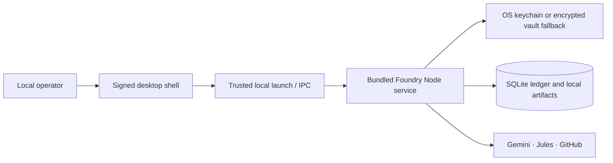

# Jules Foundry: Production-Readiness Plan for Local Users

**Status:** Proposed delivery plan.  
**Product posture:** Trusted-machine, local-first orchestration console.  
**Primary outcome:** A signed, installable desktop product that preserves Jules Foundry’s local audit trail, write-only credential vault, deterministic governance checks, and explicit operator authority.

## 1. Decision and release definition

The current application is suitable for developer-operated local use. The production objective is not to reintroduce hosted control planes; it is to package the proven local service into a secure and understandable desktop experience. The release must remain local by default: the data ledger, evidence, encrypted credentials, backups, and monitoring state belong to the operator’s device. Gemini, Google Jules, and GitHub remain explicit server-side outbound providers.

> **Production-ready local user** means a non-developer can install a signed application, understand where data lives, unlock the local vault safely, connect providers, recover from a backup, receive verified updates, and operate the tool without a shell, Node.js, pnpm, or hidden cloud dependency.

The recommended target is a **Tauri desktop shell with a bundled Node service sidecar**. The current Express/tRPC server remains the sole authority for credentials and provider calls, while the desktop shell owns installation, single-instance behavior, native key storage, lifecycle, and an application webview. Before adoption, a focused technical spike must prove that the sidecar, migrations, database, updates, and provider flows work on all supported platforms. Tauri supports desktop distribution and its updater verifies signed updates rather than allowing unsigned update artifacts.[1]

## 2. Non-negotiable product invariants

| Invariant | Production rule |
|---|---|
| Local ownership | The database, artifacts, backups, logs, and encrypted credential blobs remain in the user’s local application-data directory by default. |
| Provider isolation | Gemini, Jules, and GitHub credentials never reach renderer code and outbound provider calls occur only through the local service. |
| Write-only secrets | Credential retrieval, plaintext exports, telemetry inclusion, and verbose error logging remain prohibited. |
| Governance stays explicit | The desktop app must not silently approve plans, accept quality verdicts, delete sessions, merge pull requests, or create unbounded redispatch loops. |
| Network clarity | The product identifies every outbound provider connection and offers an offline state that disables provider actions instead of failing ambiguously. |
| Recoverability | Backup, restore, integrity verification, and rollback are understandable and testable without overwriting a live database. |
| No remote dependency creep | Optional updates and support diagnostics may contact an explicit endpoint, but no hosted account, scheduler, database, or storage becomes mandatory. |

## 3. Workstreams and delivery order

### Workstream A — Local runtime hardening

The first implementation increment hardens the current local process before packaging it. It adds an operating-system single-instance lock associated with the data directory, stale-lock recovery, orderly shutdown, signal handling, SQLite checkpoint on exit, and a visible runtime health state. The application should refuse a second process rather than allowing concurrent access to the same ledger.

| Deliverable | Acceptance criteria |
|---|---|
| Single-instance lock | A second launch focuses or reports the running instance; it never opens the same SQLite file concurrently. |
| Startup preflight | Data directory permissions, free disk threshold, migration status, vault availability, and provider configuration are assessed before the dashboard becomes operational. |
| Graceful exit | Open monitor work records a pause state, closes database handles, and leaves the SQLite ledger integrity-checkable. |
| Local process diagnostics | A redacted health bundle reports version, platform, schema version, storage capacity, and provider error classifications without credentials, cookie values, prompts, or evidence contents. |

### Workstream B — Native secret management and first-run onboarding

Introduce a `VaultKeyProvider` interface with OS-keystore implementations and an explicit passphrase fallback. The desktop application should create a random data-encryption key, retain it in the operating-system secret facility, and continue storing encrypted credential ciphertext in SQLite. The existing `scrypt` passphrase flow remains a recovery-capable fallback rather than the default end-user path.

The onboarding experience should explain local data ownership, provider-network requirements, key recovery limits, and backup behavior in plain language. It should guide the operator through vault initialization, provider credential entry and test, data-directory selection, and optional update channel selection.

| Deliverable | Acceptance criteria |
|---|---|
| Key provider abstraction | Unit and integration tests prove that keychain, fallback passphrase, lock, rotation, and unavailable-key states produce safe, actionable behavior. |
| One-time credential migration | Existing ciphertext is re-encrypted atomically under the selected local key; raw secrets are never exported or logged. |
| First-run wizard | A clean machine reaches a tested provider-ready dashboard without using a terminal. |
| Recovery UX | The product warns that losing both the OS secret and recovery passphrase requires provider credential re-entry, not secret recovery. |

Tauri’s Stronghold plugin is one candidate for encrypted secret material with an Argon2-based password-hash initialization path; it must be evaluated against native keychain integrations during the spike rather than adopted without threat-model review.[2]

### Workstream C — Desktop shell and installer

Package the existing Node service as a controlled sidecar. The shell must wait for service readiness, pass a one-time launch capability through a trusted channel, show a human-readable failure state, and prevent arbitrary renderer navigation. The existing browser-only bootstrap route remains available for advanced local-server users, but the desktop product should use a shell-mediated startup sequence.

The installer should be per-user by default, store application binaries separately from application data, preserve data on uninstall unless the operator explicitly elects to remove it, and detect prerequisite failures. Windows installers can be produced as MSI or NSIS packages; Tauri documents both choices and their differing build constraints.[3]

| Platform | Initial support target | Installer requirement |
|---|---|---|
| Windows 11 / supported Windows 10 | x64 first, then ARM64 if demand warrants | Signed per-user installer; WebView2 detection; preserve data on uninstall. |
| macOS current and previous major version | Apple Silicon first; universal build only if justified | Signed and notarized `.app`; keychain integration; correct application-data path. |
| Ubuntu LTS / selected Linux baseline | x64 first | Signed/checksummed AppImage or native package; documented secret-service prerequisite and passphrase fallback. |

### Workstream D — Backup, restore, and data-lifecycle experience

Elevate the existing safe staging helper into an operator-centered recovery workflow. The workflow must explain the difference between a backup, a staged restore, and an active-database replacement. It should create versioned local backups, support selecting a backup, integrity-check it, display its metadata, stage it into a fresh directory, then restart and verify core ledger records before making it active.

The first production release should not add unencrypted cloud backup. If future encrypted remote backup is requested, it must be optional, client-side encrypted, and designed as a separate security review.

| Deliverable | Acceptance criteria |
|---|---|
| Backup schedule choice | Manual backups are available at launch; recurring local-only reminders are opt-in and do not run hidden remote jobs. |
| Restore assistant | A user can restore into a new runtime directory, validate users/tasks/evidence/checkpoints, and revert to the previous copy on failure. |
| Data retention controls | Operators can configure local log and backup retention with a clear preview of what will be removed. |
| Export portability | Dossiers and redacted operational export files remain documented, versioned, and readable outside the application. |

### Workstream E — Release engineering, supply chain, and updates

Build a reproducible release pipeline that compiles each supported platform on its native or trusted CI runner, produces an SBOM and checksums, runs signature verification, and publishes release notes. A staged release channel should start with internal, then beta, then stable cohorts. Automatic updates must remain opt-in until recovery and rollback behavior has been validated.

Tauri’s update mechanism requires signed update artifacts and a configured public key; its production endpoints require TLS.[1] The update signing key is therefore a release-critical asset: store it in a hardware-backed or managed signing system, require two-person release approval, and rehearse key-loss and key-rotation procedures.

| Gate | Requirement |
|---|---|
| Build provenance | Release artifacts come from a protected branch and a pinned CI environment; dependency lock file and SBOM are archived. |
| Artifact integrity | Every installer has a published checksum and platform-appropriate signature. |
| Update safety | Stable artifacts are signature-verified; no silent downgrades; an operator can defer or roll back an update. |
| Privacy | Update checks reveal only the minimum version/platform information and are disabled or deferred by an explicit preference. |

### Workstream F — Quality, performance, and support operations

Expand the current 58-test suite with desktop and clean-machine release coverage. The focus is behavioral correctness across the local boundary, not merely unit coverage. Add a build-budget check and code split infrequently used routes such as evidence dossier views, detailed initiative graph, and Quality Mesh administration.

| Test layer | Required scenarios |
|---|---|
| Unit / service | Lock lifecycle, vault state machine, key rotation, migration recovery, restore validation, redaction, backup retention, updater manifest validation. |
| Integration | App launch, local session creation, database migration, restart during monitor cycle, sidecar crash recovery, provider error classification, staged restore. |
| End-to-end | First-run onboarding, credential entry/test/rotate, initiative compilation, dispatch refusal rules, active-session deletion lock, evidence dossier export, backup and restore assistant. |
| Clean-machine | Install, update, downgrade/rollback, uninstall-preserve-data, uninstall-delete-data, blocked prerequisite, corrupted local database, unavailable keychain. |
| Performance | Startup time, initial interactive load, command-deck responsiveness with large ledgers, memory under long monitoring, bundle-size regression budget. |

## 4. Release phases and decision gates

| Phase | Scope | Exit decision |
|---|---|---|
| **0. Stabilize** | Complete the current local browser-bootstrap and active-session deletion-dialog validations; add single-instance lock design and supported-platform contract. | Current developer edition is declared stable and a desktop-shell spike is approved. |
| **1. Desktop foundation** | Tauri/sidecar prototype, native lifecycle, key-provider abstraction, macOS/Windows/Linux feasibility tests. | One platform can install, launch, unlock vault, run a provider test, restart, and uninstall safely. |
| **2. Operator readiness** | First-run wizard, local runtime settings, backup/restore assistant, redacted diagnostics, bundle splitting. | Beta operators can complete first run and recovery without shell access. |
| **3. Signed beta** | Code signing, update manifest, beta channel, native clean-machine CI, support playbook. | A small beta cohort installs signed artifacts and completes core workflows with no data-loss defects. |
| **4. General availability** | Stable release channel, release process, performance budget, retained support artifacts, platform matrix sign-off. | All critical gates pass; no high-severity local-data, credential, or governance defect remains open. |

## 5. Explicit non-goals for the first local-user release

The first polished local release will not add multi-user access, remote control, automatic code acceptance, silent GitHub merges, hidden monitoring after exit, mandatory cloud backup, raw secret export, or unbounded autonomous recovery. These would change the trust model and must be scoped as separate products or security reviews.

## 6. Risk register

| Risk | Mitigation | Release blocker |
|---|---|---|
| Desktop-shell sidecar is unstable on a target OS | Prototype early on each platform; preserve browser-local developer edition as a fallback. | Yes |
| OS keychain unavailable or corrupted | Offer explicit passphrase fallback, test recovery states, and never downgrade secrecy silently. | Yes |
| Concurrent launch corrupts or blocks SQLite | Enforce one instance and test stale-lock recovery plus database integrity after forced termination. | Yes |
| Update key is compromised or lost | Hardware/managed storage, approval policy, immutable key inventory, rotation rehearsal. | Yes |
| Backup restore creates data loss | Stage before replace, verify records, retain a rollback directory, and require operator confirmation. | Yes |
| Provider API changes or outages | Retain bounded provider adapters, explicit connectivity state, retry budgets, and deterministic evidence authority. | No, unless it bypasses governance. |
| Installer friction on a platform | Per-platform pilot, concise prerequisite checks, and clear user-facing failure remediation. | No for an unsupported platform; yes for a claimed supported platform. |

## 7. First sprint backlog

The first execution sprint should not attempt a full desktop rewrite. It should produce five measurable outcomes: (1) single-instance locking with tests; (2) a Tauri-plus-sidecar feasibility spike on the primary target OS; (3) a key-provider interface with a test keychain adapter and passphrase fallback; (4) a scripted clean-machine launch, provider-test, backup, and restore scenario; and (5) a release architecture decision record. The next sprint begins the onboarding and backup/restore experience only after the native packaging boundary is proven.

## References

[1] [Tauri, “Updater”](https://v2.tauri.app/plugin/updater/)

[2] [Tauri, “Stronghold”](https://v2.tauri.app/plugin/stronghold/)

[3] [Tauri, “Windows Installer”](https://v2.tauri.app/distribute/windows-installer/)
