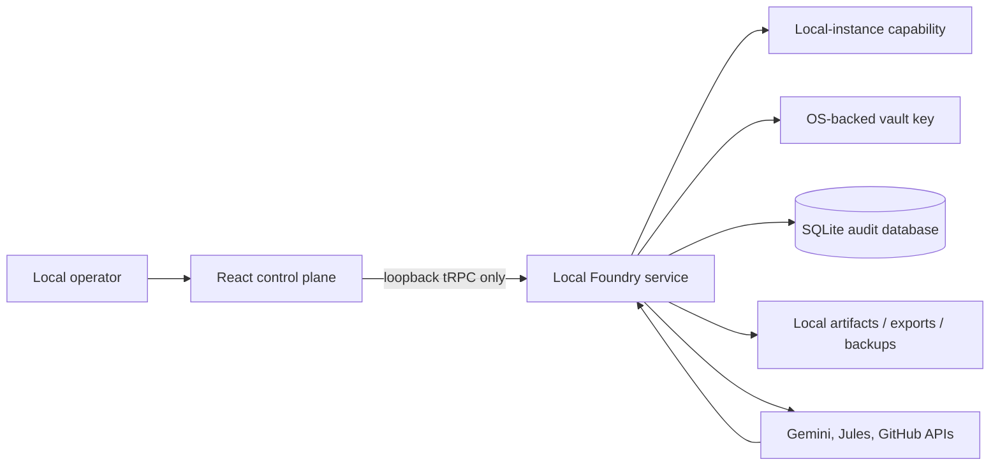

# Jules Foundry Trusted-Machine Local-First Migration Plan

**Status:** Proposed architecture and implementation plan. No hosted dependency is removed until the chosen local edition passes the migration and release gates described below.

## 1. Objective and Boundary

Jules Foundry should become a **single-operator application that runs entirely on a user’s trusted machine**. Its interface, orchestration state, audit ledger, credential vault, exports, logs, and monitoring checkpoints will live on that machine. The application will no longer require platform OAuth, a managed user account, a managed MySQL/TiDB database, hosted object storage, or hosted cron identities.

This does **not** make the product network-isolated. Gemini, Google Jules, and GitHub remain intentional outbound providers. Their API calls must continue to originate from the local server process; browser code must never receive provider secrets or call those providers directly. The Quality Mesh, proof maps, idempotency controls, deterministic checks, and operator-gated decisions remain unchanged in purpose.

> **Trust model.** The machine owner is the sole operator. The local process binds only to loopback or runs inside a desktop shell. A small local-instance capability protects the interface from unrelated web pages and accidental local-network exposure; it is not an external identity service or a multi-user login system.

## 2. Decision Options

Both options preserve the existing React, Express, tRPC, provider-adapter, and Quality Mesh concepts. The decision is primarily about installation and runtime ownership rather than product behavior.

| Option | User experience | Advantages | Tradeoffs | Setup complexity |
|---|---|---|---|---|
| **A. Local loopback application** | The user starts Jules Foundry locally; it opens in their default browser at `127.0.0.1`. | Lowest migration risk; reuses the existing Node/Express/tRPC backend; straightforward debugging; no hosted service required. | Requires a supported local Node runtime unless packaged later; monitoring runs only while the local process is running. | Low to medium |
| **B. Packaged desktop application** | The user installs and opens a native Jules Foundry app. | No separate Node installation for end users; better OS credential-vault integration; can manage lifecycle, single-instance locking, and background mode more cleanly. | Adds desktop packaging, code-signing, installer, and multi-platform release work. | Medium to high |

**Recommended sequencing:** validate Option A as the compatibility and data-migration foundation, then package that same local service in Option B. This sequence does not lock the product into a browser-only experience; it prevents a desktop-shell rewrite from obscuring correctness, provider safety, or data migration problems.

## 3. Target Local Architecture



The local service owns all privileged operations. It will bind to `127.0.0.1` and `::1` only, with no `0.0.0.0` listener, no LAN discovery, no public tunnel, and no default remote-access mode. The desktop edition can replace the browser launch with an application window, but it should retain the same server-side trust boundary and data services.

### 3.1 Local application data directory

Use the operating system’s application-data directory rather than the repository or working directory. The service should create a versioned layout such as:

```text
JulesFoundry/
  foundry.sqlite              # operational and audit state
  foundry.sqlite-wal          # SQLite WAL state while database is open
  foundry.sqlite-shm          # SQLite shared-memory state while database is open
  backups/
    2026-08-18T120000Z.sqlite # consistent database snapshots
  exports/
    task-123-dossier.json
  logs/
    foundry-2026-08-18.log
  config.json                 # non-secret settings only
  instance.json               # port/PID/version; never contains provider secrets
```

The data directory must be created with owner-only permissions where the platform permits it. It must not be placed on a network filesystem: SQLite write-ahead logging is designed for processes on the same host and uses companion `-wal` and `-shm` state files.[1]

### 3.2 Embedded database

Replace the MySQL/TiDB layer with a single local SQLite database accessed exclusively by the local server process. Drizzle supports SQLite drivers, including Node’s native SQLite support and `better-sqlite3`; the implementation should select one driver and lock it in with a compatibility test matrix.[2]

The initial implementation should use these operating rules:

| Concern | Local-first rule |
|---|---|
| Concurrency | One process owns the database. A single-instance lock prevents two Foundry processes from opening the same data directory. |
| Durability | Enable foreign keys, use WAL mode, set a finite busy timeout, and keep `synchronous=FULL` for audit and command writes. |
| Transactions | Dispatch, command-ledger insert, lease acquisition, idempotency checks, and state transitions use one transaction. |
| Migrations | Keep versioned, transactional SQLite migrations. Test every migration on a copied fixture database and enforce idempotent startup. |
| Backups | Use the database backup API or a checkpointed consistent snapshot; do not copy only the main database file while a WAL connection is open. SQLite documents that the WAL file is part of persistent database state.[1] |
| Restore | Restore into a new directory, integrity-check it, then swap only after the current instance is stopped. |

To minimize churn, the first SQLite schema retains the `users` table and the existing `userId` relationships, but seeds one immutable local operator (`id=1`, `openId=local-operator`, `role=admin`). This preserves current query ownership filters and audit attribution while eliminating account lifecycle and externally sourced identities. A later cleanup may remove the redundant multi-user fields after stable releases.

## 4. Replace Hosted Authentication With Local Instance Protection

The following hosted components become removable: OAuth callback registration, hosted identity exchange, account synchronization, platform application identifiers, hosted owner identifiers, and scheduled-task impersonation.

The replacement is intentionally **not “no protection.”** A loopback listener can still be reached by software on the same machine, and a browser can be induced to send some cross-origin requests. The local edition should therefore use a zero-prompt, local-instance capability:

1. On every launch, generate a cryptographically random, one-time bootstrap token in memory.
2. Open the browser only at `http://127.0.0.1:<ephemeral-port>/?bootstrap=<token>`. Do not log the complete URL.
3. Consume the token once and issue an `HttpOnly`, `SameSite=Strict`, path-scoped local session cookie. Never persist the bootstrap token.
4. Require that local cookie for all tRPC procedures, validate the `Host` header against the loopback listener, and require same-origin `Origin` checks for state-changing requests.
5. Reject non-loopback peers, absent or mismatched local cookies, unexpected origins, and any CORS request. Set a restrictive content-security policy that prevents arbitrary remote scripts.
6. In the desktop edition, pass an equivalent launch capability through the trusted desktop shell instead of exposing it to normal navigation.

`createContext` will return the seeded `local-operator` only after this local boundary check. `protectedProcedure` and `adminProcedure` can therefore keep their existing policy meaning, while the following code is retired or replaced: `server/_core/sdk.ts`, `server/_core/oauth.ts`, the hosted login launcher, hosted logout behavior, platform session cookie helpers, OAuth environment variables, and cron-specific identity handling.

## 5. Preserve a Write-Only Local Credential Vault

The local edition keeps the current write-only dashboard semantics. A credential submitted in the UI travels only to the local service, is encrypted before persistence, and is never returned by list, read, export, telemetry, error, or log responses. Provider calls continue to decrypt only inside the local server boundary.

The current vault derives its encryption material from a web-session secret. Replace that dependency with a dedicated vault-key provider:

| Priority | Mechanism | Behavior |
|---|---|---|
| Primary | OS credential vault / secure storage | Store a random 256-bit data-encryption key using the logged-in OS account’s protected credential store; database rows hold AES-GCM ciphertext, IV, authentication tag, and key version. |
| Fallback | User-provided startup passphrase | Derive a key with a memory-hard password KDF, retain it only in process memory, and require re-entry after restart. |
| Recovery | Explicit credential re-entry | Never silently export or copy decrypted provider secrets into a migration file, bug report, or backup bundle. |

The local database backup contains encrypted credential blobs, not plaintext provider secrets. Restore requires the matching operating-system credential entry or the user’s passphrase. Credential rotation remains versioned and auditable; the original key is not revealed as part of a rotation or test flow.

## 6. Local Files, Evidence, and Exports

Replace the hosted storage adapter and storage proxy with a local file service rooted beneath the application-data directory. Store only safe, application-created files there: generated dossiers, user-requested exports, bounded provider response artifacts, and optional redacted diagnostic bundles. Sanitize each path, reject traversal, set conservative file modes, and serve content through explicit local routes rather than constructing arbitrary filesystem URLs.

Artifacts should retain digest, origin, and creation-time metadata in SQLite. The export format should remain portable JSON/Markdown with schema versioning. A diagnostics export must omit decrypted secrets, local bootstrap tokens, raw authorization headers, and provider request bodies that contain credential material.

## 7. Local Monitoring and Recovery Lifecycle

Jules is remote, but the scheduler that monitors a Jules session need not be hosted. Replace platform cron or heartbeat assumptions with a local monitor supervisor running inside the local service:

1. On startup, query monitor checkpoints and resume only overdue, non-terminal sessions.
2. Run adaptive `setTimeout`-based polling while Foundry is open, using the existing checkpoint, error-streak, lease, and idempotency logic.
3. Persist the result of every poll before scheduling the next one; restarting the application must not duplicate provider activities or commands.
4. When the application is closed, show monitoring as **paused locally** rather than implying that remote supervision continues.
5. On next launch, reconcile sessions explicitly and resume only as allowed by the existing Quality Mesh and session-control policies.

An optional later setting can install a user-level background helper for operators who want monitoring while the window is closed. It must be opt-in, use the same local database and vault, bind to no external interface, and be stoppable from the application. It must never create autonomous redispatch loops.

## 8. Compatibility Migration Phases

### Phase 0 — Freeze and define the supported local edition

Create a release branch and document supported operating systems, Node/runtime version for the browser edition, application-data location, and the chosen desktop-packaging path. Add a dependency inventory that identifies every reference to hosted OAuth, managed database, hosted storage, analytics, and platform-only server code.

Before editing production behavior, export a **redacted** project data backup for test purposes. Do not attempt to migrate existing encrypted credential values from the hosted environment; users must re-enter provider credentials into the local vault. This avoids exporting material that was protected by a server-side key.

### Phase 1 — Introduce a local runtime boundary

Add a `local` runtime configuration with explicit modes: development loopback, packaged loopback, and desktop shell. Refactor environment access behind a `RuntimeConfig` interface so provider base URLs, data path, port policy, and vault strategy are local configuration rather than platform injection. Fail closed if the service is asked to bind beyond loopback.

### Phase 2 — Port persistence to SQLite

Create a parallel SQLite schema and migration history. Translate MySQL enum columns to checked text values, timestamps to a single consistent representation, and auto-increment/index constraints to SQLite equivalents. Retain every invariant that protects task idempotency, command idempotency, provider activity deduplication, leases, and quality provenance.

Build a one-time importer for non-secret operational data: initiatives, tasks, event ledger, attempts, approvals, evidence, Quality Mesh records, command ledger, leases, and monitor checkpoints. Run import inside a transaction, validate row counts and digests, and write a migration report. Treat incomplete imports as failures with no partial local state.

### Phase 3 — Replace hosted identity paths

Implement the local-instance capability, seed the local operator, and switch context creation to it. Remove platform OAuth routes and client redirect code only after tests prove that every protected router still rejects missing or cross-origin requests and attributes actions to the local operator.

### Phase 4 — Replace storage and credential-key dependencies

Introduce the OS-backed vault-key provider and local file service. Migrate credential profiles only as empty profile metadata where helpful; require key re-entry and test each credential locally. Replace hosted storage URLs with local artifact IDs and controlled download routes. Remove Forge storage proxy registration and analytics injection from the local build.

### Phase 5 — Localize the monitor supervisor

Move reconciliation scheduling into a local monitor service. Preserve existing adaptive poll intervals, control leases, event deduplication, rate limits, and recovery budgets. Add explicit start, pause, resume, and shutdown behavior, including an operator-visible statement that monitoring stops when the local process stops.

### Phase 6 — Package and distribute

For the browser edition, provide a signed release archive or installer that starts the local service, selects an available loopback port, opens the capability-bearing URL, and writes data only under the user’s local application-data directory. For the desktop edition, bundle the same service behind a native shell and integrate operating-system secure storage, single-instance locking, automatic updates, and code signing.

### Phase 7 — Decommission hosted-only code only after acceptance

Delete platform OAuth, platform database, hosted storage, storage proxy, hosted analytics, and platform scheduling dependencies after a local-first release passes the gates below. Keep the old hosted branch read-only until a documented rollback window expires.

## 9. Required Acceptance and Release Gates

| Area | Acceptance criterion |
|---|---|
| No hosted runtime dependency | Start, use, stop, restart, and restore the product with no platform OAuth, managed database, storage proxy, analytics, or scheduler configured. |
| Local-only exposure | Listener accepts only loopback peers; Host/origin/capability checks reject external, cross-origin, or stale-bootstrap requests. |
| Credential protection | Raw provider secrets never appear in rendered HTML, API responses, logs, exports, database plaintext inspection, or regression fixtures. |
| Data integrity | SQLite foreign-key checks and integrity checks pass; task and command idempotency constraints survive migration and restart. |
| Monitoring correctness | Restarting during an active session resumes from checkpoints without duplicate activity records, duplicate commands, or uncontrolled redispatch. |
| Provider isolation | Gemini, Jules, and GitHub calls occur only from server-side adapters, honor timeouts, and redact authorization material on errors. |
| Backup / restore | A consistent snapshot restores into a clean data directory and reproduces task timeline, Quality Mesh provenance, and evidence dossier output. |
| Product behavior | Exact health labels remain `healthy`, `stale`, `attention`, and `terminal`; evidence labels remain `proven`, `partial`, `unproven`, and `contradicted`. |
| Regression coverage | Existing 53 tests remain green after porting, supplemented by local-auth, SQLite migration, vault, local storage, monitor-resume, and backup/restore tests. |
| Installation | A clean supported machine can install, enter credentials, compile an initiative, dispatch a Jules session, monitor it, export a dossier, and uninstall without leaving plaintext secrets behind. |

## 10. Risks and Mitigations

| Risk | Mitigation |
|---|---|
| A user assumes “local” means no network calls | Label provider integrations as outbound and display each provider endpoint purpose in Settings. Offer an offline mode that disables dispatch and inference instead of failing ambiguously. |
| SQLite migration changes query behavior | Create a parallel adapter, run fixture imports, compare deterministic outputs, and retain MySQL implementation on the hosted branch through the rollback window. |
| Credential loss after OS-profile reset | Explain that credential blobs need the matching OS vault key or passphrase; provide safe re-entry flows rather than secret export. |
| Loopback CSRF or port scanning | Use loopback-only binding, a one-use launch capability, strict cookie/origin checks, Host validation, no permissive CORS, CSP, and short-lived bootstrap tokens. |
| Monitoring pauses when laptop sleeps or app exits | Surface pause state, preserve checkpointed resume, and make optional background mode explicit rather than pretending to provide hosted availability. |
| Multi-process database access | Enforce a single-instance lock and use the same local application-data directory only from the owning process. |
| Packaging creates platform-specific defects | Keep the loopback edition as the reference runtime and run clean-machine smoke tests on each supported operating system before desktop packaging is declared supported. |

## 11. First Implementation Slice

The lowest-risk first slice is a **local developer edition** with no user-visible product changes: add the local configuration boundary, loopback-only server startup, seeded local operator, SQLite adapter on a new data directory, and a test-only data importer. Keep the hosted implementation intact behind a separate runtime flag during this slice. Once data integrity, credential vault behavior, and session monitoring pass locally, replace the hosted auth and storage paths and then package the proven local runtime.

This approach is deliberately staged. The product’s operational governance is more valuable than a fast rewrite: Jules Foundry should never lose the ability to explain what it dispatched, why it polled, what it observed, or how it determined that a task was ready for human acceptance.

## References

[1] [SQLite, “Write-Ahead Logging”](https://www.sqlite.org/wal.html)

[2] [Drizzle ORM, “Drizzle <> SQLite”](https://orm.drizzle.team/docs/sqlite/get-started-sqlite)

[3] [Tauri, “SQL Plugin”](https://v2.tauri.app/plugin/sql/)
